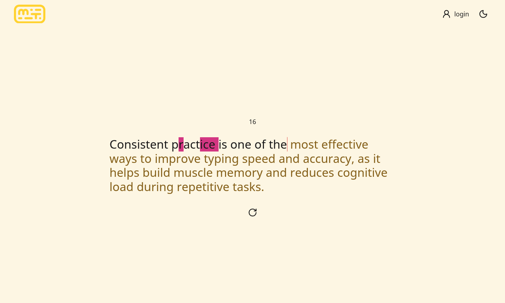
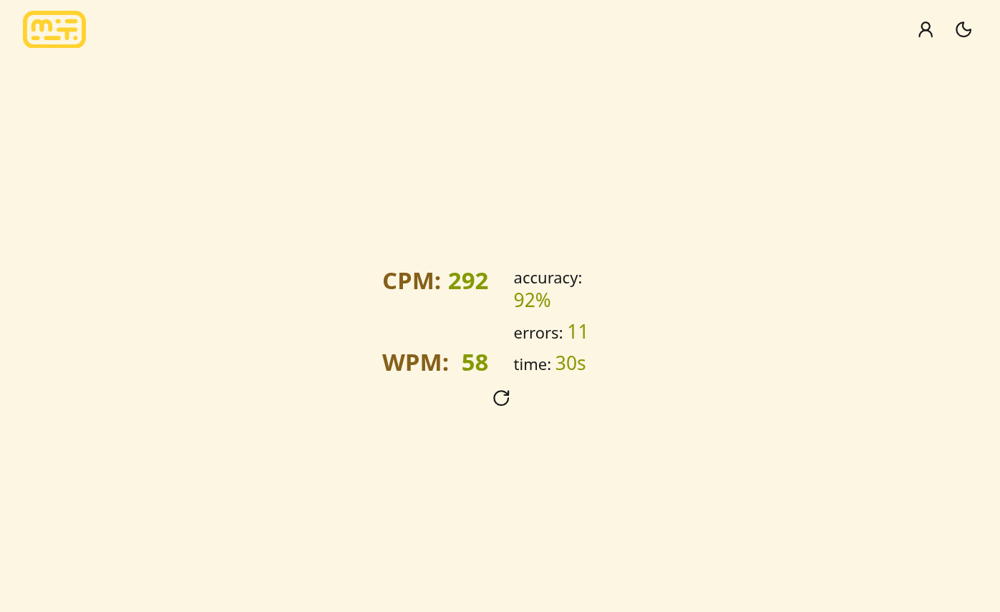
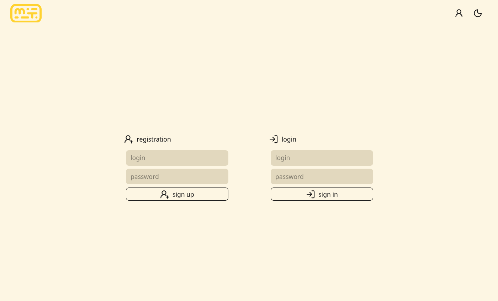
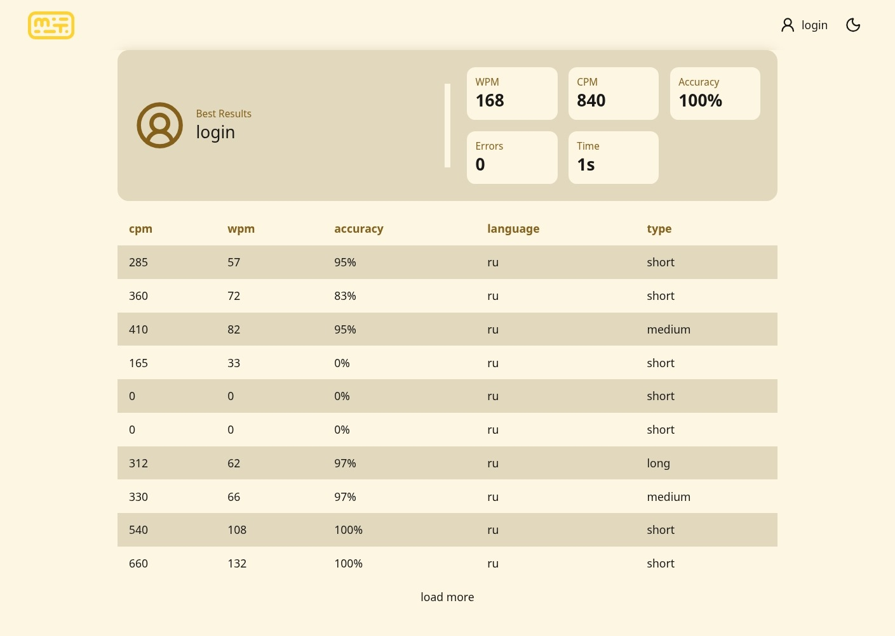
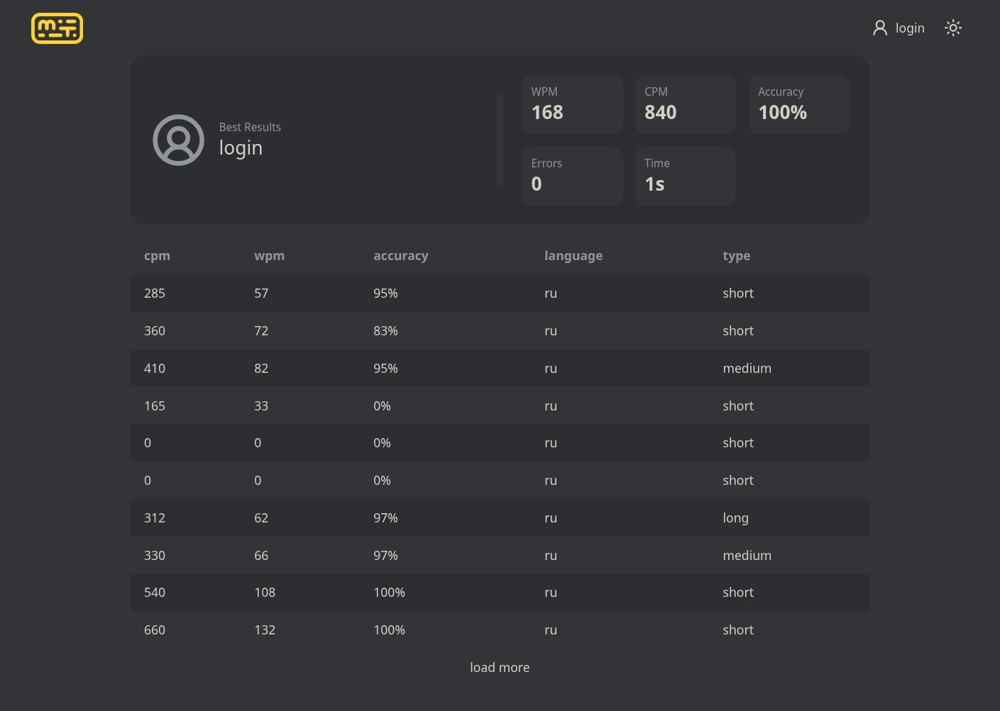

# React Typing Speed Test

Fullstack typing speed test application inspired by Monkeytype.

# Features

- Typing speed test
- CPM / WPM calculation
- Accuracy tracking
- Error counting
- User authentication (JWT token)
- Personal statistics
- Best results tracking
- Responsive UI
- REST API
- Lazy loading for user results (Pagination)
- PostgreSQL database integration


---

# Screenshots

## Main Page



## Results



## Login / Registration



## Profile / Statistics



## Dark theme



---

# Tech Stack

## Frontend

- React
- TypeScript
- React Router
- TanStack Query
- TailwindCSS
- Axios
- Zustand
- Vite

## Backend

- Node.js
- Express
- PostgreSQL
- JWT Authentication

## Database

- PostgreSQL

---

# Architecture

## Frontend

The frontend uses Feature-Sliced Design architecture.

```text
src/
├── app/
├── pages/
├── widgets/
├── features/
├── entities/
└── shared/
```

Main frontend principles:

- feature-based architecture
- reusable UI components
- separation of business logic and UI
- server-state management with TanStack Query
- typed API layer generated from OpenAPI

## Backend

The backend uses layered architecture:

```text
routes -> controllers -> services -> database
```

---

# API

REST API documented with OpenAPI.

Main endpoints:

```http
POST /auth/login
POST /auth/registration

GET /auth/me

GET /results
GET /results/best

POST /results

GET /texts
```

---

# Database Schema

Main entities:

- users
- results
- texts

---

# Getting Started

## Clone repository

```bash
git clone https://github.com/your-name/react-typing-speed-test.git
cd react-typing-speed-test
```

---

## Install dependencies

Install all dependencies for both frontend and backend:

```bash
npm install
```

---

## Environment Variables

Create a `.env` file inside the `server/` directory.

You can copy it from:

```bash
server/.env.example
```

### Example `.env`:

```env
PORT=3000

DB_USER=postgres
DB_PASSWORD=password
DB_NAME=react_typing_speed_test
DB_HOST=localhost
DB_PORT=5433

JWT_SECRET=your_secret_key
```

---

## Database (Docker)

The project uses PostgreSQL running in Docker.

### Start database

```bash
npm run docker
```

This will:
- start PostgreSQL container
- create database
- apply initial schema and seed data

### Stop database

```bash
npm run docker-down
```

### Reset database (deletes all data)

```bash
npm run docker-drop
```

---

## Run application

Start both frontend and backend:

```bash
npm run dev
```

Launch specifically frontend

```bash
cd frontend
npm run dev
```

Launch specifically backend

```bash
cd backend
npm run dev
```

- Frontend: http://localhost:5173 (or Vite default port)
- Backend: http://localhost:3000

---

## OpenAPI generation (optional)

If needed, regenerate API clients:

```bash
npm run openapigen
```

---

# Future Improvements

- Multiplayer typing mode
- Charts and analytics

---

# Technical Challenges

- Optimizing typing calculations
- Preventing unnecessary React rerenders
- Designing REST API structure
- Pagination and caching with TanStack Query
- API typing with OpenAPI generator

---

# Author

Maksim Kuzminov

**email**: kuzminovm78@gmail.com
